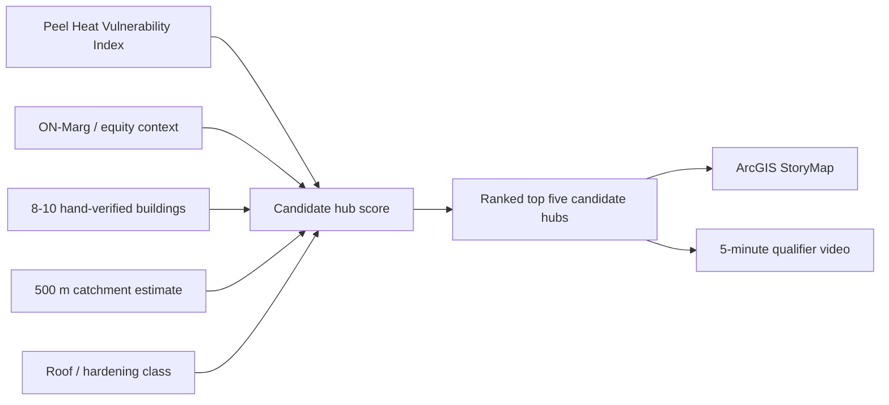

# feat: Activate Sanctuary resilience hub StoryMap

## Overview

Sanctuary replaces Valley as the active Seneca Energy Hackathon submission. It is a fast, sponsor-aligned ArcGIS StoryMap and Web Map/Dashboard that ranks trusted Peel community buildings as candidate resilience hubs for heat waves, floods, and outages.

The deliverable is not a full custom app. The deliverable is a 5-minute qualifier video built around one crisp decision: **if Peel can harden only five community buildings before the next heat wave, which five should come first?**

## Problem Frame

Theme 3 asks teams to show how energy and climate challenges land unevenly across communities. Sanctuary focuses that into a municipal planning problem: people most exposed to heat and outages are often not within easy reach of a reliable, cool, powered, trusted place.

The non-default move is to stop treating the official shelter network as complete. Sanctuary starts with heat vulnerability, then asks which trusted local buildings should be hardened into the next resilience hubs.

## Requirements Trace

- R1. Replace Valley cleanly; do not run Valley and Sanctuary in parallel.
- R2. Re-lock scope to Theme 3, likely Problem Statement 2: climate risks, vulnerable populations, and shelter access.
- R3. Build the minimum strong artifact: ArcGIS StoryMap, one Web Map or Dashboard, one candidate-hub CSV, and one 5-minute video.
- R4. Use 8 to 10 hand-verified candidate buildings in Peel, with real names and addresses.
- R5. Make the demo moment proper-noun specific: one named building in or near a high-HVI area, then a ranked top-five reveal.
- R6. Label every modelled value directly: candidate hub, modelled 500 m estimate, planning estimate, requires site audit.
- R7. Keep the scoring simple enough for a judge to understand in 20 seconds.
- R8. Preserve sponsor fit: Esri through ArcGIS StoryMaps/Web Maps; Alectra through resilience hubs, DER hardening, and Peel-region planning.

## Scope Boundaries

- No custom web app unless ArcGIS fails.
- No accounts, auth, persistence, API routes, or database.
- No live microgrid, VPP control, dispatch engine, or real-time operations dashboard.
- No claim that named buildings are already equipped with solar, batteries, cooling capacity, backup power, or emergency agreements unless verified.
- No precise kW/kWh engineering sizing. Use rough classes and labels.
- No city beyond Peel unless the data forces a Brampton-only version for speed.

### Deferred to Separate Tasks

- Actual engineering feasibility study for selected buildings.
- Community partner outreach.
- Real Network Analyst walksheds if 500 m buffers are enough for the video.
- Post-hackathon custom app or command center.

## Context & Research

### Relevant Project Docs

- `sanctuary/README.md` states Sanctuary is backup-only unless `.hackathon/scope.md` is amended.
- `sanctuary/docs/developer-build-plan.md` defines the product as a StoryMap/Dashboard, not a custom app.
- `sanctuary/docs/storymap-and-data-guide.md` defines the StoryMap structure, data sources, visual language, and ArcGIS-first fallback.
- `sanctuary/docs/sanctuary-introduction-faq.md` gives the clearest one-sentence pitch and risk framing.
- `docs/themes.md` confirms Theme 3 rewards clear maps, visuals, and decision-maker-facing tools.
- `docs/energy-domain.md` lists relevant public energy, equity, climate, and open-data sources.

### External / Shared Context

- Gemini shared review validated Sanctuary as a strong Theme 3 contender but noted public precedents under "community resilience hubs." Treat that as validation, not uniqueness. The originality must come from Local-Detail: real Peel places, real heat vulnerability, and one ranked decision.
- `demo-moment-critic` verdict: BORDERLINE, fixable to LANDS if the first click uses a real named building, the panel includes honesty labels, and the top-five reveal is framed as a ranked decision.
- `scope-defender` verdict: OUT_OF_SCOPE_CUT unless Valley is replaced entirely.

## Key Technical Decisions

- Use ArcGIS first. The sponsor fit and speed matter more than owning a custom UI.
- Build around one named hero building. The first 10 seconds cannot be a generic GIS click.
- Use a 500 m buffer by default. Network Analyst is optional only if it is available quickly.
- Use rough buckets for hardening potential: small, medium, large. Avoid false precision.
- Keep VPP and financing as "future operating model" context, not the prototype's main claim.
- Store the candidate list and scoring inputs in a repo CSV so the video numbers are auditable.

## Open Questions

### Resolved During Planning

- Should Sanctuary run alongside Valley? No. It replaces Valley or remains backup-only.
- Should this be a full app? No. StoryMap/Web Map is the minimum lovable build.
- Should faith/community buildings be included? Yes, but use asset-based language and include civic/community sites too.

### Deferred to Implementation

- Exact hero building: choose during candidate verification. The final video cannot proceed without one proper-noun building.
- Brampton-only vs full Peel: prefer Peel, but allow Brampton-only if candidate verification or ArcGIS layering slows down.
- Exact HVI join method: use the public Peel HVI layer directly if possible; otherwise inspect and bucket manually for the 8 to 10 candidates.

## Output Structure

```text
sanctuary/
  data/
    candidate-hubs.csv
    sources.md
    scoring-notes.md
  artifacts/
    arcgis-links.md
    screenshots/
  docs/
    storymap-script.md
    video-script.md
    judge-qa.md
    methods-note.md
docs/plans/
  2026-05-25-001-feat-sanctuary-activation-plan.md
```

## High-Level Technical Design

> This illustrates the intended approach and is directional guidance for review, not implementation specification. The implementing agent should treat it as context, not code to reproduce.



## Implementation Units

- [ ] **Unit 0: Re-lock Hackathon Scope**

**Goal:** Officially replace Valley with Sanctuary before implementation time is spent.

**Requirements:** R1, R2

**Dependencies:** User decision to amend scope.

**Files:**
- Modify: `.hackathon/scope.md`
- Modify: `.hackathon/scope-log.md`
- Modify: `.hackathon/demo-moment.md`
- Modify: `.hackathon/video-script.md`
- Modify: `README.md`
- Modify: `sanctuary/README.md`

**Approach:**
- Re-lock challenge to Theme 3, likely Problem Statement 2.
- Re-lock pattern-break to Public-Good Frame + Local-Detail.
- Cut Valley ULO plug/map from the active submission.
- Add the 10-second Sanctuary script: heat-vulnerability zone -> named building click -> honesty-labelled panel -> ranked five.
- Run `demo-moment-critic` again after the exact hero building is selected.

**Patterns to follow:**
- `.hackathon/scope.md` current structure.
- `sanctuary/README.md` scope status language.

**Test scenarios:**
- Test expectation: none -- documentation/scope update only.

**Verification:**
- `.hackathon/scope.md` no longer lists Valley must-haves as active work.
- Scope log explicitly states Valley was cut to activate Sanctuary.
- Demo moment includes a fallback if ArcGIS or the exact layer fails.

- [ ] **Unit 1: Build the Candidate Hub Data Spine**

**Goal:** Create an auditable list of 8 to 10 candidate buildings with enough fields to rank and explain them.

**Requirements:** R4, R6, R7

**Dependencies:** Unit 0.

**Files:**
- Create: `sanctuary/data/candidate-hubs.csv`
- Create: `sanctuary/data/sources.md`
- Create: `sanctuary/data/scoring-notes.md`

**Approach:**
- Include a mix of worship, library, recreation, community, and civic facilities.
- Hand-verify name, address, municipality, building type, and approximate location.
- Add fields from `sanctuary/docs/developer-build-plan.md`: `heat_quintile`, `catchment_method`, `reachable_population_est`, `roof_area_class`, `solar_potential_est`, `verification_status`.
- Choose one hero building before any video scripting is finalized.

**Patterns to follow:**
- `sanctuary/docs/developer-build-plan.md` section 7.
- `sanctuary/docs/storymap-and-data-guide.md` section 4.

**Test scenarios:**
- Happy path: candidate has name, address, type, municipality, heat bucket, catchment method, roof class, verification status -> candidate can appear on map and in ranked table.
- Edge case: candidate has uncertain solar/roof data -> keep it in the dataset only if labelled as `requires site verification`.
- Error path: candidate lacks a real public name or address -> exclude it from the showcase set.

**Verification:**
- CSV contains 8 to 10 rows.
- Every row has a real name, address, type, municipality, and verification status.
- At least one candidate is viable as the hero click in a high-HVI area.

- [ ] **Unit 2: Assemble the ArcGIS Web Map**

**Goal:** Produce the map layer stack that supports the StoryMap and demo recording.

**Requirements:** R3, R5, R6, R8

**Dependencies:** Unit 1.

**Files:**
- Create: `sanctuary/artifacts/arcgis-links.md`
- Create: `sanctuary/artifacts/screenshots/`
- Update: `sanctuary/data/sources.md`

**Approach:**
- Add Peel HVI as the base vulnerability layer.
- Add candidate building points from `candidate-hubs.csv`.
- Add 500 m buffers or simple catchment rings around candidate buildings.
- Use red/orange only for heat vulnerability and deep blue/teal for candidate hubs.
- Style the selected hero building with a distinct accent and large label.

**Patterns to follow:**
- `sanctuary/docs/storymap-and-data-guide.md` sections 1, 3, and 5.

**Test scenarios:**
- Happy path: hero building appears in or near a high-HVI area and opens a detail panel with required labels.
- Edge case: ArcGIS layer does not support the desired join -> manually bucket the 8 to 10 candidate points and document the method.
- Error path: HVI layer cannot load during recording -> use a static screenshot fallback and disclose it in `methods-note.md`.

**Verification:**
- Web Map link is recorded in `sanctuary/artifacts/arcgis-links.md`.
- Screenshot shows HVI layer, candidate points, hero label, and catchment/buffer.
- Detail panel includes "candidate hub, not currently equipped."

- [ ] **Unit 3: Implement the Transparent Ranking Model**

**Goal:** Rank the candidate buildings with a simple model judges can understand quickly.

**Requirements:** R5, R6, R7

**Dependencies:** Unit 1.

**Files:**
- Update: `sanctuary/data/candidate-hubs.csv`
- Update: `sanctuary/data/scoring-notes.md`
- Create: `sanctuary/docs/methods-note.md`

**Approach:**
- Use the scoring model from the existing plan:
  - 35% heat vulnerability nearby
  - 25% vulnerable population within catchment
  - 20% trust / community role
  - 10% rooftop hardening potential
  - 10% facility suitability
- Prefer high/medium/low buckets over decimal precision.
- Ensure the final top five can be explained in one sentence each.

**Patterns to follow:**
- `sanctuary/docs/developer-build-plan.md` section 6.

**Test scenarios:**
- Happy path: high-HVI, high-reach, trusted building scores above a lower-risk candidate.
- Edge case: a civic site has better facility suitability but lower trust/local role -> scoring notes explain the tradeoff.
- Error path: a candidate ranks high only because of an unverifiable estimate -> downgrade or remove it from the ranked five.

**Verification:**
- Top five are reproducible from the CSV fields.
- Every ranked candidate has a "why this ranks here" note.
- Methods note visibly separates real, estimated, and unverified fields.

- [ ] **Unit 4: Build the StoryMap Narrative**

**Goal:** Turn the map into a judge-ready narrative artifact.

**Requirements:** R3, R5, R6, R8

**Dependencies:** Units 2 and 3.

**Files:**
- Create: `sanctuary/docs/storymap-script.md`
- Update: `sanctuary/artifacts/arcgis-links.md`
- Update: `sanctuary/docs/methods-note.md`

**Approach:**
- Structure sections as: heat map -> shelter gap -> trusted buildings -> hero click -> ranked five -> honesty box -> ask.
- Put the hero click early, not after a long explainer.
- Use proper nouns for places and neighborhoods.
- Keep copy asset-based: trusted community infrastructure, not pity framing.

**Patterns to follow:**
- `sanctuary/docs/storymap-and-data-guide.md` section 2.
- `sanctuary/docs/sanctuary-introduction-faq.md` sections 2, 3, and 9.

**Test scenarios:**
- Happy path: a viewer understands the top-five hardening decision within the first minute.
- Edge case: viewer challenges estimates -> StoryMap points to the honesty box and methods note.
- Error path: StoryMap feels like a generic dashboard -> revise opening to start with the named hero building and the ranked decision.

**Verification:**
- StoryMap link is captured in `sanctuary/artifacts/arcgis-links.md`.
- The opening section contains a real place name, not generic "a community building" language.
- Honesty box appears before the final ask.

- [ ] **Unit 5: Produce the 5-Minute Qualifier Video**

**Goal:** Record the video that sells Sanctuary as a concrete decision-support tool.

**Requirements:** R3, R5, R6, R8

**Dependencies:** Units 2, 3, and 4.

**Files:**
- Create: `sanctuary/docs/video-script.md`
- Modify: `.hackathon/video-script.md`
- Create: `sanctuary/artifacts/screenshots/`

**Approach:**
- Use this 10-second anchor:
  - 0:00: Heat-vulnerability area glows dark red.
  - 0:02: Click `<Hero Building Name>`, `<Address>`.
  - 0:05: Panel opens with "candidate hub, not currently equipped," reachable population estimate, HVI level, and roof/hardening class.
  - 0:08: Top five candidate hubs animate with the line: "If Peel can harden only five buildings first, Sanctuary ranks these five."
- Full video arc: problem -> named hero click -> scoring -> ranked five -> honesty -> Alectra/Esri fit.
- Include one collaboration line if this is a team submission.

**Patterns to follow:**
- `sanctuary/docs/developer-build-plan.md` section 8.
- `.hackathon/scope.md` video-script discipline.

**Test scenarios:**
- Happy path: viewer can describe the project two hours later as "the one that picks the five trusted buildings Peel should harden first."
- Edge case: ArcGIS interaction is slow -> record a clean preloaded take or use screenshots.
- Error path: exact hero building is not verified -> do not use it as the opening click.

**Verification:**
- Video is under 5 minutes.
- The first 10 seconds show a named building and a ranked decision.
- Every modelled number visible on screen is labelled.

- [ ] **Unit 6: Package Provenance and Judge Q&A**

**Goal:** Make the project defensible under sponsor and judge questioning.

**Requirements:** R6, R7, R8

**Dependencies:** Units 1 through 5.

**Files:**
- Create: `sanctuary/docs/judge-qa.md`
- Update: `sanctuary/docs/methods-note.md`
- Update: `sanctuary/README.md`
- Update: `README.md`

**Approach:**
- Prepare short answers for: Are these already hubs? Are the solar/battery numbers measured? Why places of worship? Why not just cooling centres? Is this scalable beyond Peel?
- Replace placeholder citations in `sanctuary/docs/sanctuary-command-center-introduction-faq.md` before using any of that copy in public materials.
- Keep the pitch grounded in siting and prioritization, not claims of operational control.

**Patterns to follow:**
- `sanctuary/docs/storymap-and-data-guide.md` section 6.
- `sanctuary/docs/sanctuary-introduction-faq.md` section 8.

**Test scenarios:**
- Happy path: judge asks how ranking works -> answer points to five weighted buckets and the methods note.
- Edge case: judge asks whether a building agreed to participate -> answer says candidate hub, requires site verification.
- Error path: judge asks for exact battery sizing -> answer says outside prototype scope and requires site audit.

**Verification:**
- README names Sanctuary as active only after scope is amended.
- Judge Q&A contains direct, non-defensive answers.
- No public-facing copy contains unresolved `[source needed]` placeholders.

## System-Wide Impact

- **Active project identity:** Valley must be cut from the active scope to avoid split effort.
- **Demo artifact:** The submitted artifact becomes a video-first ArcGIS StoryMap, not a deployed app.
- **Data contract:** `candidate-hubs.csv` becomes the source of truth for names, scores, and labels.
- **Credibility invariant:** All modelled values must be labelled at the point of display, not hidden in footnotes.
- **Pattern-break invariant:** Proper nouns and local detail are mandatory. Generic "trusted building" language weakens the concept.

## Risks & Dependencies

| Risk | Mitigation |
|---|---|
| It becomes a generic GIS dashboard | Open on one named place and one ranked decision. |
| Solar/battery claims look fake | Use classes and "planning estimate, requires site audit" labels. |
| OSM/community-building data is incomplete | Hand-verify only 8 to 10 showcase buildings. |
| Faith-building framing feels tokenistic | Mix civic and faith/community sites; use asset-based language. |
| ArcGIS setup burns time | Fall back to static map screenshots plus ranked table. |
| Scope split with Valley | Unit 0 must cut Valley before implementation begins. |
| Hero building cannot be verified | Pick another candidate; do not force an unverifiable proper noun. |

## Documentation / Operational Notes

- The first implementation action is scope amendment, not ArcGIS work.
- Keep `sanctuary/docs/developer-build-plan.md` as the working reference, but this plan becomes the execution checklist.
- If ArcGIS fails, the backup deliverable is a slide/video version with the same data spine, not a custom app rebuild.
- After the exact hero building is chosen, run `demo-moment-critic` again and update the script until it reaches LANDS.

## Sources & References

- Origin document: `sanctuary/docs/developer-build-plan.md`
- StoryMap guide: `sanctuary/docs/storymap-and-data-guide.md`
- Simple FAQ: `sanctuary/docs/sanctuary-introduction-faq.md`
- Command-center FAQ: `sanctuary/docs/sanctuary-command-center-introduction-faq.md`
- Current scope requiring amendment: `.hackathon/scope.md`
- Theme source: `docs/themes.md`
- Domain sources: `docs/energy-domain.md`
- Shared Gemini review: https://gemini.google.com/share/c3e8ba9ddf22
