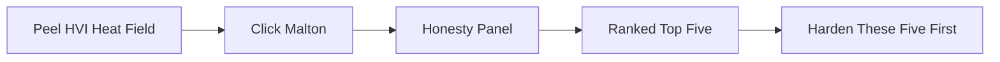
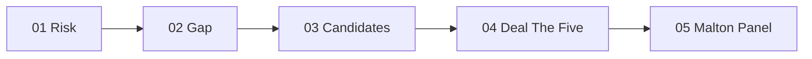

# Sanctuary Personal Local Showcase Upgrade

## Why This Plan Exists

Leo wants the Sanctuary website to feel **personal, local, tactile, and human-made**.

The current site is already strong on data and demo logic, but the next design pass should make it feel less like something another team could generate with AI. The goal is not to add more product scope. The goal is to make the existing support showcase feel like **a real Peel civic artifact**: proper nouns, real building photos, archival Peel texture, source captions, and a memorable ranked decision.

The site should feel like:

- A public planning field note about Peel before the next heat wave.
- A civic data-journalism story.
- A local proof board: real place, real address, real heat risk, honest uncertainty.
- A hand-crafted support artifact for the ArcGIS StoryMap/video.

The site should not feel like:

- A generic climate SaaS landing page.
- A shadcn/Tailwind dashboard.
- A glowing AI command center.
- A stock-photo sustainability website.
- A fake operations tool claiming to dispatch infrastructure.

## Locked Project Context

Project: **Sanctuary**.

Event: **Seneca Energy Hackathon 2026**.

Theme: **Theme 3 · Problem Statement 2**: community energy, equity, climate resilience, vulnerable populations, and shelter access.

Judged deliverable: **a 5-minute YouTube video demoing the ArcGIS StoryMap/Web Map**, not the deployed website. The website is a support showcase and clickable recording backup.

Locked pattern-break:

- **Primary:** Public-Good Frame.
- **Reinforcing:** Local-Detail.

The remembered idea must be:

> The one that picks the five trusted Peel buildings to harden before the next heat wave.

Hero building:

- **Malton Community Centre and Library**
- **3540 Morning Star Drive, Mississauga**
- Verified HVI quintile **5**
- PHDZ **M-04**
- CTUID **5350530.01**

Locked top five:

1. Malton Community Centre and Library
2. Sri Guru Singh Sabha Malton
3. Susan Fennell Sportsplex
4. Anjuman-E-Anwarul Islam of Malton
5. Bharat Mata Mandir

The key demo flow:



## Existing Technical Context

Main app path:

- [`sanctuary/web`](../../sanctuary/web)

Stack:

- Next.js 16 App Router.
- React 19.
- Hand-written CSS in [`sanctuary/web/app/globals.css`](../../sanctuary/web/app/globals.css).
- No Tailwind.
- No shadcn.
- Motion via `motion@12.40.0`.
- Map rendered with hand-rolled d3-geo SVG.
- d3-geo projection must stay server-side.
- Static GeoJSON/data loaded at build time.

Current key files:

- [`sanctuary/web/app/page.tsx`](../../sanctuary/web/app/page.tsx): current main page composition.
- [`sanctuary/web/app/layout.tsx`](../../sanctuary/web/app/layout.tsx): fonts and metadata.
- [`sanctuary/web/app/globals.css`](../../sanctuary/web/app/globals.css): design system and all main styles.
- [`sanctuary/web/components/Hero.tsx`](../../sanctuary/web/components/Hero.tsx): current hero with giant `5`, `harden`, Pearson `35.8 °C`, and Malton.
- [`sanctuary/web/components/ScrollStage.tsx`](../../sanctuary/web/components/ScrollStage.tsx): one client island for scrollytelling map sequence.
- [`sanctuary/web/components/MapStage.tsx`](../../sanctuary/web/components/MapStage.tsx): SVG map, HVI choropleth, facilities, candidate pins, pan/zoom in explore mode.
- [`sanctuary/web/components/DetailPanel.tsx`](../../sanctuary/web/components/DetailPanel.tsx): selected hub panel and planning checklist UI.
- [`sanctuary/web/components/EvidenceTag.tsx`](../../sanctuary/web/components/EvidenceTag.tsx): verified/modelled/pending tags.
- [`sanctuary/web/lib/content.ts`](../../sanctuary/web/lib/content.ts): copy, sourced facts, photo metadata, evidence lists, sources, Q&A.
- [`sanctuary/web/lib/hubs.ts`](../../sanctuary/web/lib/hubs.ts): candidate hub transformation, HVI colors, score/evidence data. Reuse this. Do not rewrite scoring.

Existing design rules:

- [`sanctuary/web/CLAUDE.md`](../../sanctuary/web/CLAUDE.md) is the local design constitution.
- The signature move is sacred: **scroll-pinned Peel map that performs the decision**.
- Ember is signal only.
- Heat colors are only for heat risk.
- Fraunces is display.
- Mono is for all data: scores, ranks, HVI, addresses, honesty tags, source labels.
- Honesty labels are first-class and must use icon + text, never color alone.
- No stock solar photos.
- No generic disaster imagery.
- No `AI-powered` feature framing.

## Current Research Sources To Read First

Do not re-derive the project from scratch. Read these first:

1. [` .hackathon/scope.md`](../../.hackathon/scope.md)
   - Locked scope, demo moment, top-five reveal, explicit cuts.

2. [`sanctuary/web/CLAUDE.md`](../../sanctuary/web/CLAUDE.md)
   - Website-specific design system and anti-slop firewall.

3. [`docs/showcase-research-2026-05-26.md`](../showcase-research-2026-05-26.md)
   - Domain research, HVI verification, design direction, references.

4. [`docs/showcase-assets-and-techniques.md`](../showcase-assets-and-techniques.md)
   - Free assets, icon strategy, imagery rules, texture ideas, motion/accessibility guidance.

5. [`docs/showcase-design-language.md`](../showcase-design-language.md)
   - Civic heat-resilience field report design language and map-led UX references.

6. [`docs/plans/2026-05-26-001-showcase-redesign-interactive-map.md`](2026-05-26-001-showcase-redesign-interactive-map.md)
   - Existing multi-page / big-map plan. This new plan complements that direction but is specifically about making the site more personal/local and less AI-generated.

## Design North Star

### Visual Thesis

**Malton heat ledger.**

A dark civic map field with real local imagery, archival Peel texture, and a ranked public decision. The interface should feel like a municipal planning brief with a human point of view.

### What Must Be Memorable

The first remembered object is the giant `5`.

The first remembered place is **Malton Community Centre and Library**.

The first remembered action is **harden these five first**.

The first remembered credibility signal is **verified / modelled / pending**.

### Emotional Register

Serious, warm, local, protective.

Not doom.

Not glossy.

Not startup.

Not generic climate optimism.

### Surface Language

Use:

- Real place photography.
- Archival Peel map fragments.
- Ruled source strips.
- Captioned figures.
- Mono labels and tabular numbers.
- Hairline dividers.
- Slight paper/grain texture.
- Asymmetric editorial layouts.

Avoid:

- Centered tagline + two CTA buttons as the main composition.
- Uniform card grids everywhere.
- Decorative gradients.
- Glassmorphism.
- Aurora/beams/confetti.
- Stock photos of solar panels or wind turbines.
- Fake 3D globes.
- Generic people imagery.
- Hover-only interactions.
- Color-only meaning.

## Free Asset Research

### Real Place Photos

Primary source: Wikimedia Commons.

Use only assets that show actual project-relevant places.

Priority finds:

- **Malton CC and Library.jpg**
  - Source: Wikimedia Commons.
  - Author: Matt Pascal.
  - License: CC BY-SA 4.0.
  - Use: hero/local place section.

- **Malton Community Centre.jpg**
  - Source: Wikimedia Commons.
  - Photographer: Christine Lee / Tuvok649.
  - License: CC BY 3.0.
  - Note: older image with local-resident provenance.
  - Use: optional archival/personal contrast.

- **Malton Community Centre and Library Plaque.jpg**
  - Source: Wikimedia Commons.
  - Author: TerryMississauga.
  - License: CC BY-SA 4.0.
  - Use: small evidence/photo fragment, not a main hero image.

- **Gore Meadows Library and Community Centre.jpg**
  - Source: Wikimedia Commons.
  - Author: Astral Luna.
  - License: CC BY-SA 4.0.
  - Use: optional supporting/contrast image. Be careful: Gore Meadows is not the hero because it verified as HVI quintile 2.

Already referenced in [`sanctuary/web/lib/content.ts`](../../sanctuary/web/lib/content.ts):

- `/photos/malton-cc-library.jpg`
- `/photos/malton-westwood-square.jpg`
- `/photos/peel-1937-map.jpg`

Before implementation, verify whether these files already exist in [`sanctuary/web/public/photos`](../../sanctuary/web/public/photos). If missing, download optimized, licence-compatible copies.

### Archival Peel Maps

Primary source: Region of Peel Archives uploads on Wikimedia Commons.

Useful sources:

- Region of Peel Archives, RPA map and plan collection.
- 1877 Illustrated Historical Atlas of the County of Peel.
- Tremaine Map of Peel County, 1859.
- Guidal map collections.
- PAMA / Region of Peel Archives for additional government record context.

Use archival maps as **place texture and local context**, not as evidence of current heat risk.

Good uses:

- Faint cropped archival map strip behind/beside hero.
- Captioned figure in a “why Malton” section.
- Subtle source-strip background for the methods/sources area.

Bad uses:

- Making archival map look like current data.
- Using it as generic decoration without caption.
- Letting it compete with the HVI map.

### Aerial / Orthophoto Sources

Possible sources:

- Ontario GeoHub / Geospatial Ontario imagery.
- OpenAerialMap.
- NRCan National Air Photo Library / Open Government Portal.

Use only if licence and direct usability are clear.

Likely use:

- Optional supporting crop.
- Not required for the first implementation.
- Do not replace the HVI map.

### Texture Sources

Preferred:

- Inline SVG `feTurbulence` grain directly in CSS.
- Low-opacity local SVG contour/topographic motif.

Possible browser generators:

- fffuel `gggrain`
- Noise Gradient

Rules:

- Texture must be subtle.
- No decorative gradient fields.
- No high-CPU animation.
- Disable/reduce where appropriate.

## Planned Website Upgrades

### 1. Hero Upgrade

Files:

- [`sanctuary/web/components/Hero.tsx`](../../sanctuary/web/components/Hero.tsx)
- [`sanctuary/web/app/globals.css`](../../sanctuary/web/app/globals.css)
- [`sanctuary/web/lib/content.ts`](../../sanctuary/web/lib/content.ts)

Goal:

Make the first viewport feel like a local civic poster, not a generic landing page.

Current ingredients are good:

- Giant `5`.
- Word `harden`.
- Pearson `35.8 °C`.
- Malton Community Centre and Library.
- CTA to decision.
- ArcGIS link.

Upgrade direction:

- Recompose hero as an asymmetric poster.
- Keep the giant `5` dominant.
- Add Malton address/evidence as a compact data strip:
  - `3540 Morning Star Drive`
  - `HVI quintile 5`
  - `candidate hub, not equipped`
  - `verified / modelled / pending`
- Add one real local image fragment, likely Malton exterior or plaque.
- Add visible caption/source for the image.
- Keep CTA secondary. The hero should be remembered for the claim and place, not the button.

Acceptance:

- Above the fold, a judge sees: five buildings, Peel, Malton, heat risk, honest uncertainty.

### 2. Asset Metadata and Attribution System

Files:

- [`sanctuary/web/lib/content.ts`](../../sanctuary/web/lib/content.ts)
- [`sanctuary/web/components/sections/SourcesSection.tsx`](../../sanctuary/web/components/sections/SourcesSection.tsx)
- [`sanctuary/web/app/globals.css`](../../sanctuary/web/app/globals.css)

Goal:

Make attribution part of the design language.

Plan:

- Normalize asset metadata objects:
  - `src`
  - `alt`
  - `caption`
  - `credit`
  - `license`
  - `source.name`
  - `source.url`
  - `usage`
- Add a reusable caption/source strip style.
- Show short attribution near every image.
- Include full source details in the sources section if needed.

Acceptance:

- Every image/archival asset has visible attribution.
- The attribution reinforces credibility instead of feeling bolted on.

### 3. Local Place Section

Files:

- [`sanctuary/web/components/sections`](../../sanctuary/web/components/sections)
- [`sanctuary/web/lib/content.ts`](../../sanctuary/web/lib/content.ts)
- [`sanctuary/web/app/globals.css`](../../sanctuary/web/app/globals.css)

Goal:

Add or strengthen a section that answers: **Why does Malton start the list?**

Content ingredients:

- Real photo of Malton Community Centre and Library.
- Name and address.
- HVI quintile 5.
- PHDZ M-04.
- CTUID 5350530.01.
- Candidate hub, not currently equipped.
- Site audit required.
- Source link to official building page.

Design:

- Figure + compact data ledger.
- Caption/source strip.
- Optional archival map fragment as background/context.
- Avoid card-grid feel.

Acceptance:

- The section feels like a specific place, not a generic “community hub” block.

### 4. Decision Map Polish

Files:

- [`sanctuary/web/components/ScrollStage.tsx`](../../sanctuary/web/components/ScrollStage.tsx)
- [`sanctuary/web/components/MapStage.tsx`](../../sanctuary/web/components/MapStage.tsx)
- [`sanctuary/web/components/RankedList.tsx`](../../sanctuary/web/components/RankedList.tsx)
- [`sanctuary/web/components/CandidateTable.tsx`](../../sanctuary/web/components/CandidateTable.tsx)
- [`sanctuary/web/app/globals.css`](../../sanctuary/web/app/globals.css)

Goal:

Make the signature map sequence legible in a screen recording.

Sequence:



Planned polish:

- Clearer active step styling.
- Stronger rank hierarchy for top-five pins.
- More obvious receding treatment for non-top-five candidates during decision state.
- Selected pin/list row feedback: blink-then-settle or subtle scale/outline.
- Keep map controls quiet.
- Ensure mobile/reduced-motion path still tells the whole story.

Acceptance:

- A viewer can say: risk appears, the gap appears, candidates appear, then the top five become the answer.

### 5. Honesty System Pass

Files:

- [`sanctuary/web/components/DetailPanel.tsx`](../../sanctuary/web/components/DetailPanel.tsx)
- [`sanctuary/web/components/EvidenceTag.tsx`](../../sanctuary/web/components/EvidenceTag.tsx)
- [`sanctuary/web/components/ScrollStage.tsx`](../../sanctuary/web/components/ScrollStage.tsx)
- [`sanctuary/web/app/globals.css`](../../sanctuary/web/app/globals.css)

Goal:

Make `verified`, `modelled`, and `pending` the visual credibility signature.

Plan:

- Move inline styles in `DetailPanel.tsx` into CSS classes.
- Standardize evidence tag sizing and alignment.
- Use the same evidence language in:
  - map legend
  - hero/place ledger
  - detail panel
  - method section
  - sources/captions
- Make `candidate hub, not equipped` prominent.
- Keep Gemini/planning checklist clearly secondary and labelled.

Acceptance:

- No user has to guess what is measured, estimated, or pending.

### 6. Section Ledger Pass

Files:

- [`sanctuary/web/components/sections/ProblemSection.tsx`](../../sanctuary/web/components/sections/ProblemSection.tsx)
- [`sanctuary/web/components/sections/MethodSection.tsx`](../../sanctuary/web/components/sections/MethodSection.tsx)
- [`sanctuary/web/components/sections/HonestySection.tsx`](../../sanctuary/web/components/sections/HonestySection.tsx)
- [`sanctuary/web/components/sections/EvidenceSection.tsx`](../../sanctuary/web/components/sections/EvidenceSection.tsx)
- [`sanctuary/web/components/sections/FutureSection.tsx`](../../sanctuary/web/components/sections/FutureSection.tsx)
- [`sanctuary/web/components/sections/SourcesSection.tsx`](../../sanctuary/web/components/sections/SourcesSection.tsx)
- [`sanctuary/web/app/globals.css`](../../sanctuary/web/app/globals.css)

Goal:

Reduce generic card-grid monotony.

Plan:

- Replace some uniform cards with ruled rows and ledger blocks.
- Add source strips to claims.
- Use asymmetric layouts where helpful.
- Let proof sections feel like a credible dossier.
- Keep copy short, specific, and sourced.

Acceptance:

- Lower sections feel like a hand-built civic evidence package, not auto-generated feature cards.

## Implementation Order

1. **Read context**
   - `.hackathon/scope.md`
   - `sanctuary/web/CLAUDE.md`
   - this plan
   - `docs/showcase-assets-and-techniques.md`
   - `docs/showcase-design-language.md`

2. **Asset audit**
   - Check [`sanctuary/web/public/photos`](../../sanctuary/web/public/photos).
   - Confirm what images already exist.
   - Pick no more than 2-4 local assets for the first pass.

3. **Content metadata**
   - Update [`sanctuary/web/lib/content.ts`](../../sanctuary/web/lib/content.ts) with final asset metadata and local-place copy.

4. **Hero redesign**
   - Update [`sanctuary/web/components/Hero.tsx`](../../sanctuary/web/components/Hero.tsx).
   - Update CSS in [`sanctuary/web/app/globals.css`](../../sanctuary/web/app/globals.css).

5. **Local place section**
   - Add or refine a section under [`sanctuary/web/components/sections`](../../sanctuary/web/components/sections).
   - Add it to [`sanctuary/web/app/page.tsx`](../../sanctuary/web/app/page.tsx) if appropriate.

6. **Decision-stage polish**
   - Improve step/pin/rank/final panel styling.
   - Preserve reduced-motion and mobile paths.

7. **Honesty system cleanup**
   - Move inline styles from `DetailPanel.tsx`.
   - Standardize tags, captions, source strips.

8. **Ledger pass**
   - Reduce card-grid repetition.
   - Add ruled rows/source strips/asymmetric proof layouts.

9. **Verification**
   - `cd sanctuary/web && npm run build`
   - Visual desktop check.
   - Visual mobile check.
   - Keyboard check.
   - Reduced-motion check.
   - Asset attribution check.
   - Confirm no new unsupported claims.

## Guardrails

Do not:

- Add Tailwind.
- Add shadcn.
- Add MapLibre, Leaflet, deck.gl, or react-simple-maps.
- Add GSAP.
- Add generic stock imagery.
- Add generic solar-panel/wind-turbine images.
- Add fake disaster imagery.
- Add new precise kW/kWh claims.
- Add new product features without scope amendment.
- Turn the website into an operations dashboard.
- Hide or weaken honesty labels.
- Use color alone to encode meaning.
- Make archival maps imply historical heat risk.
- Touch ArcGIS StoryMap scope unless explicitly asked.

Do:

- Keep changes scoped to the support showcase.
- Keep the map and ranked decision central.
- Use local proper nouns.
- Use real sources.
- Keep all modelled/pending values labelled.
- Make the design feel human and Peel-specific.
- Verify before saying done.

## Acceptance Criteria

The upgrade is successful if:

- The first screen cannot be mistaken for a generic AI-generated website.
- Malton Community Centre and Library is visually and textually anchored.
- At least one real local image or archival Peel fragment is used tastefully and attributed.
- The map sequence remains the strongest visual moment.
- The top-five reveal is legible in a recording.
- Honesty labels are consistent and prominent.
- Every asset has source/author/licence recorded.
- Build passes.
- Desktop/mobile/reduced-motion/keyboard paths remain usable.

## Next-Session Starter Prompt

Use this if starting a fresh session:

```text
We are picking up Sanctuary in C:\Users\leooa\Documents\personal-projects\Synergy-v2.0.

Do not implement until you read:
- docs/plans/2026-05-26-002-personal-local-showcase-upgrade.md
- .hackathon/scope.md
- sanctuary/web/CLAUDE.md
- docs/showcase-assets-and-techniques.md
- docs/showcase-design-language.md

Goal: improve sanctuary/web so it feels personal, local, tactile, and human-made, not AI-generated. Keep the locked demo: five trusted Peel buildings to harden first, with Malton Community Centre and Library as the hero. Use real local/free assets where licence-safe: Wikimedia Commons Malton photos, Region of Peel archival maps, PAMA/Peel context, subtle local SVG texture. No generic stock sustainability imagery.

Start by auditing sanctuary/web/public/photos and sanctuary/web/lib/content.ts, then implement the plan in docs/plans/2026-05-26-002-personal-local-showcase-upgrade.md. Preserve no Tailwind, no new map stack, no new unsupported claims, verified/modelled/pending labels everywhere, and run npm run build in sanctuary/web before declaring done.
```
